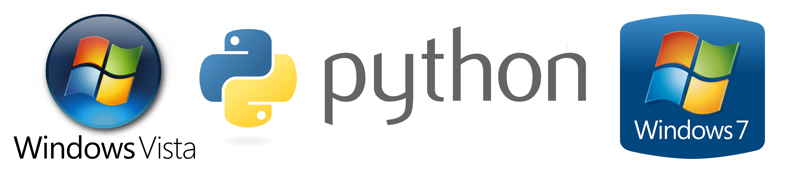

# Python 3.9+ for Windows Vista and Windows 7

This repository contains installers of Python 3.9 and newer versions for Windows Vista and Windows 7 and the source code of the Python programming language which is adapted for Windows Vista and Windows 7 with the instructions on how to build it.

## Introduction

Python is a popular programming language that is widely used in almost all fields of software development. Python has been continuously evolving since its inception. However, one significant change that recently occurred in Python was the drop of support for Windows Vista and Windows 7. This decision has sparked a lot of debate among developers and users, with some supporting this change and others giving negative criticism about it.

## Theoretical background

Since version 3.9, Python requires ```api-ms-win-core-path-l1-1-0.dll``` which is absent in Windows Vista and Windows 7. Prior to version 3.9, the library was dynamically imported; starting from Python 3.9, [the dynamic load is replaced with a static import](https://github.com/izbyshev/cpython/commit/6a65eba44bfd82ccc8bed4b5c6dd6637549955d5) of ```api-ms-win-core-path-l1-1-0.dll``` which breaks the compatibility with Windows Vista and Windows 7.

With the development of Python, the number of changes incompatible with Windows Vista and Windows 7 keeps growing, as a result of which the support for these operating systems requires more effort when backporting newer versions. For example, the [change in the launcher which adds support for Windows ARM64 devices](https://github.com/python/cpython/issues/90724) makes the problem more complicated because old Windows versions do not understand what ARM is.

I give credit to [Aohan Dang](https://www.linkedin.com/in/aohan-dang-536643a7/), a professional software developer and Python enthusiast, whose core method of building Python with ```api-ms-win-core-path-l1-1-0.dll``` for Windows 7 is used here. I provide a way to backport Python to Windows Vista. If you need more installers just for Windows 7, you can visit Aohan's repository.

## Building

Building instructions for different versions of the Python programming language are different. Each folder with each Python version has its own building instructions.

## Where compatibility problems may arise

**The core interpreters and the standard libraries of the Python programming language run correctly on Windows Vista and Windows 7.** Nothing is cut or modified in the Python programming language itself, and the disabled support for Windows ARM64 devices in Python 3.11+ does not influence the behaviour of the interpreters. The interpreters in these installers read the code in the same exact way as the interpreters in the official Python installers. However, in the future, you may experience compatibility issues with ```pip``` packages. The reason is that developers of these packages may drop support for Windows Vista and Windows 7, considering that officially Python 3.9 and newer versions are not intended for these operating systems. I cannot provide any help with such kind of trouble because I have no control over thousands of Python software packages. In this case, I recommend contacting the developer of the specific package which causes the compatibility issue.

### See also: [Node.js 14+ for Windows 7](https://github.com/vladimir-andreevich/node.js-windows-7)
